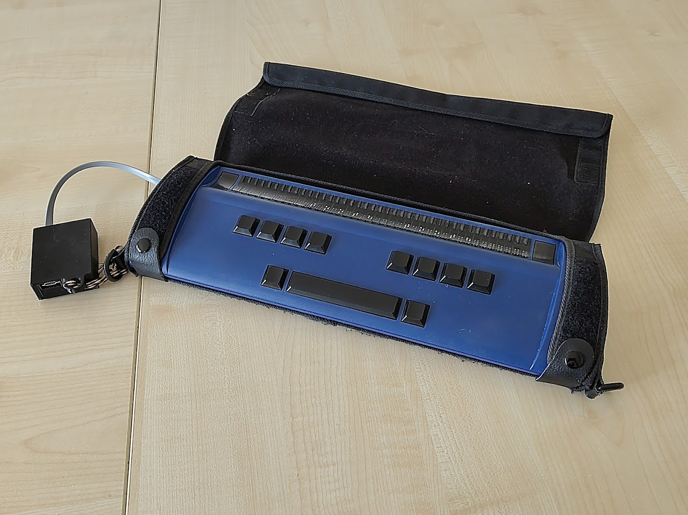
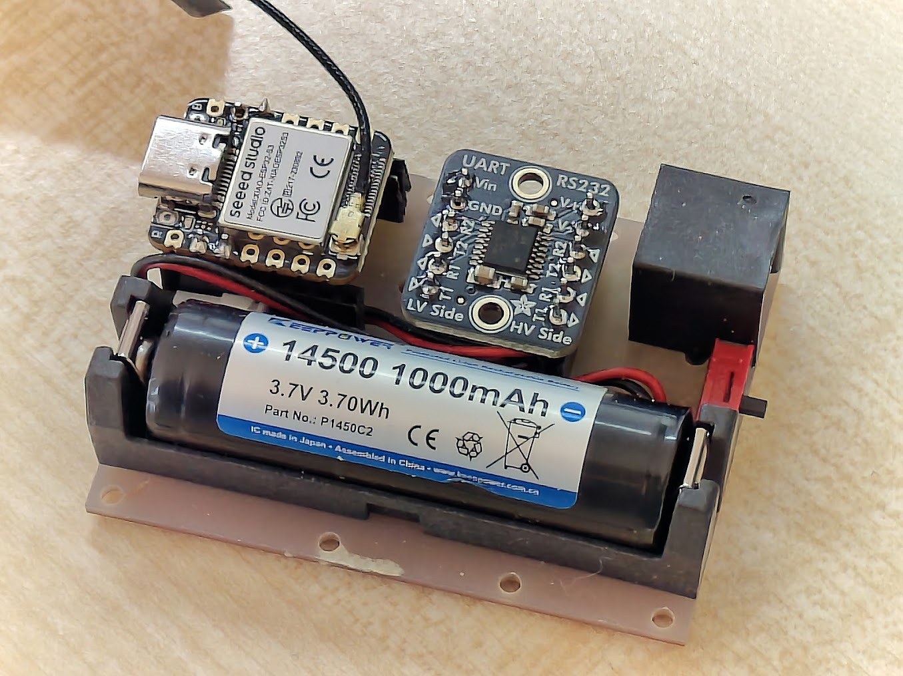
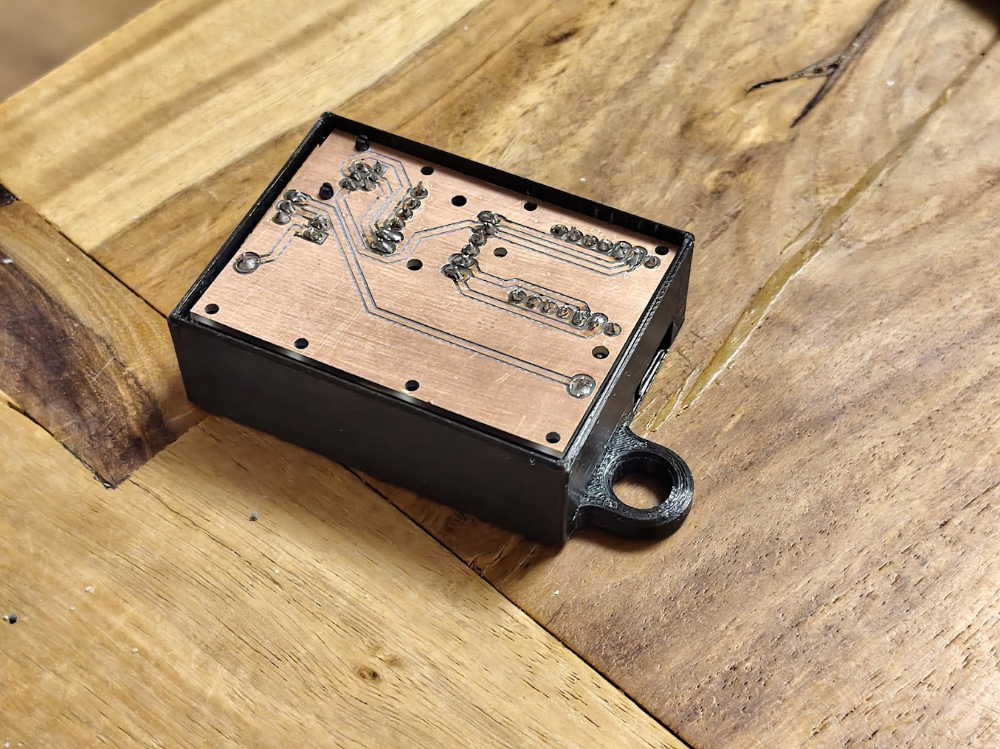
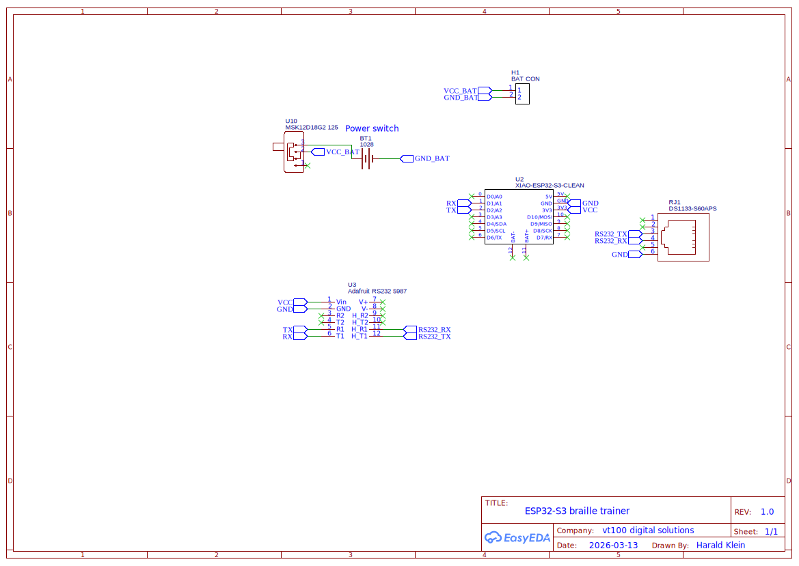
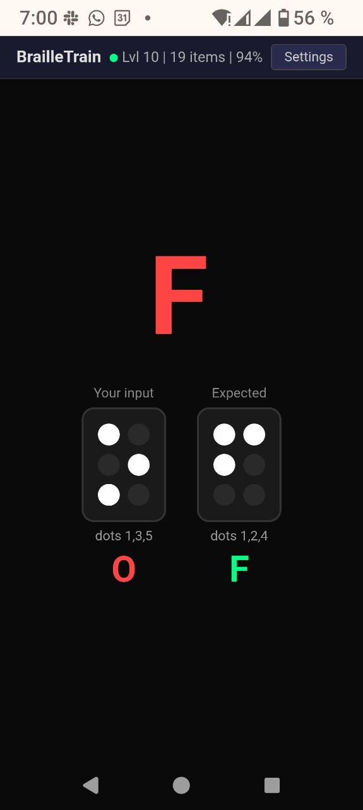

# ESP32-S3 Braille Trainer

A braille training device that connects an ESP32-S3 to a HandyTech BrailleWave 40-cell display via MAX232 level shifter. Includes a web UI for settings and monitoring, BLE HID pass-through for screen reader use, and maintenance tools.



## Hardware

- Seeed Studio XIAO ESP32-S3 (or ESP32-S3-DevKitC-1)
- HandyTech BrailleWave (40 cells, HT serial protocol)
- MAX232 level shifter (TTL ↔ RS-232)
- 14500 Li-Ion battery (3.7V 1000mAh)

```
XIAO:      D1/A1 (GPIO2, TX) → MAX232 → RJ-12 → BrailleWave
           D2/A2 (GPIO3, RX) ← MAX232 ← RJ-12 ← BrailleWave

DevKitC-1: GPIO 7 (TX) → MAX232 → RJ-12 → BrailleWave
           GPIO 6 (RX) ← MAX232 ← RJ-12 ← BrailleWave
```

| | |
|---|---|
|  |  |
| XIAO ESP32-S3, MAX232, 14500 battery holder | Custom PCB in 3D-printed case with RJ-12 connector |

### Bill of Materials

| Component | Description | Link |
|---|---|---|
| Seeed Studio XIAO ESP32-S3 | Microcontroller with WiFi + BLE | [Seeed Wiki](https://wiki.seeedstudio.com/xiao_esp32s3_getting_started/) |
| Adafruit RS232 Pal | MAX3232E dual-channel UART to RS-232 level shifter | [Adafruit 5987](https://www.adafruit.com/product/5987) |
| Keystone 1028 | 14500 / AA battery holder | |
| MSK12D18G2 | SPDT slide switch, 3-pin, 2.54mm pitch (or any compatible) | |
| RJ-12 socket | 6P6C through-hole, for direct connection to BrailleWave | |
| 14500 Li-Ion battery | 3.7V 1000mAh (AA-size lithium) | |

### Schematic

<a href="pcb/Schematic_esp32-brailletrain_2026-03-22.svg"></a>

### PCB

Gerber files and a DXF for CNC milling are in the `pcb/` directory. The PCB was designed as a single-layer board, CNC milled with only the bottom side island-routed (see the included DXF).

**Note:** One screw hole collides with the 5V SMD pad on the XIAO ESP32-S3. This was not fixed since it doesn't matter for the milled version (no top copper). If you plan to send the Gerber to a PCB manufacturer, be aware of this overlap — you'll likely want to leave the top copper layer empty or remove that pad from the design.

## Features

### Training
- Letter, word, and mixed training modes
- 26-level progressive curriculum (teaching order: e, a, i, o, s, h, b, c, ...)
- Oxford 5000 word list with frequency weights, filtered by introduced letters
- Per-letter statistics, confusion tracking, streak counting
- Auto-advancement when accuracy thresholds are met
- Confusable pair drills (d/f, e/i, h/j, m/n, etc.) plus actual confusion-based selection
- Per-letter confusion tracking across both letter and word modes (e.g., bed→beg records d/g confusion)
- Mirror mode (right-hand) and wide word spacing options
- Ergonomic positioning: left word at cell 12, mirror at cell 24, 4-cell gap
- Configurable max word length
- All settings persisted across reboots

### Web UI



- Real-time WebSocket updates at `http://brailletrain.local`
- Does not reveal the prompted letter/word — only shows result after input
- Level selector, mode switcher, option toggles
- Screen wake lock during training (releases after 5 min inactivity)
- Optional sound feedback: chime on correct, buzz on error (Web Audio API, no samples)
- Statistics panel: per-letter accuracy table, top confusion pairs, overall stats
- Reset option to clear all statistics and settings (e.g., for user change)
- BrailleWave connection status indicator with auto-reconnect

### WiFi
- Always runs AP mode (SSID: `BrailleTrain`, open)
- Optional STA mode — scan and connect to existing networks from the web UI
- Credentials saved to flash, auto-reconnects on boot
- mDNS: `http://brailletrain.local`

### BLE HID Braille Display (Dual Protocol)
- Advertises as "BrailleWave 40" (BLE HID, appearance 0x03C9)
- When a screen reader connects via BLE, the device enters pass-through mode
- Host cell data → ESP32 → UART → BrailleWave display
- BrailleWave keys → UART → ESP32 → HID input reports → Host
- Auto-reverts to trainer mode on BLE disconnect
- **Dual protocol support** — both served simultaneously on one BLE HID service:
  - **Standard HID Braille** (Usage Page 0x41, reports 0x11/0x12/0x13): for iOS VoiceOver, Android TalkBack, and other standard HID Braille consumers
  - **HandyTech USB-HID** (Vendor reports 0x01/0x02/0xFB/0xFC): serial tunnel for brltty's `ht` driver — wraps HT UART frames in HID reports
- PnP ID: HandyTech vendor 0x1FE4, product 0x0003 (USB-HID adapter)

#### brltty on Linux (Fedora/GNOME)

brltty's `ht` driver uses USB-specific HID APIs, so BLE HID requires a bridge.
`braille-bridge.py` translates between the ESP32's HT vendor HID reports and a
PTY that brltty reads as a serial device.

```bash
# Build the tcsetattr shim (one-time, needed because PTYs don't support parity)
gcc -shared -fPIC -o /tmp/pty_serial_shim.so - -ldl <<'EOF'
#define _GNU_SOURCE
#include <dlfcn.h>
#include <termios.h>
#include <unistd.h>
#include <errno.h>
typedef int (*fn)(int, int, const struct termios *);
int tcsetattr(int fd, int a, const struct termios *t) {
    static fn real = 0;
    if (!real) real = (fn)dlsym(RTLD_NEXT, "tcsetattr");
    int r = real(fd, a, t);
    if (r == -1 && errno == EINVAL && isatty(fd)) { errno = 0; return 0; }
    return r;
}
EOF

# Start bridge (auto-detects hidraw device)
sudo python3 braille-bridge.py &

# Start brltty
sudo LD_PRELOAD=/tmp/pty_serial_shim.so brltty -b ht -d /tmp/braillewave -n &

# Start Orca for GUI braille output
orca --replace &
```

### Status LED
- Flashes during BrailleWave connection attempts (yellow on DevKitC-1, white on XIAO)
- Solid on when connected (green on DevKitC-1, white on XIAO)
- Off when disconnected

### Maintenance
- **Exercise mode**: flips all dots on/off at slow (1s) or fast (200ms) intervals for 5 or 15 minutes — for pin break-in and cleaning
- **Test mode**: cycles through every dot on every cell sequentially; reports all key presses/releases in the web UI
- **Auto-reconnect**: detects BrailleWave sleep/power-off after 30s inactivity, reconnects within 3s of power-on (uses HT ping when supported, falls back to reset)
- Manual reconnect button
- **Device probe**: queries serial number, firmware version, cell count, RTC, firmness, ping support via HT extended protocol
- **RTC sync**: synchronize BrailleWave clock from ESP32 (requires NTP via WiFi STA)
- **Firmness control**: adjust pin pressure (soft/medium/hard) on supported models

## Building

Requires [PlatformIO](https://platformio.org/).

```bash
pio run              # build
pio run -t upload    # flash
```
